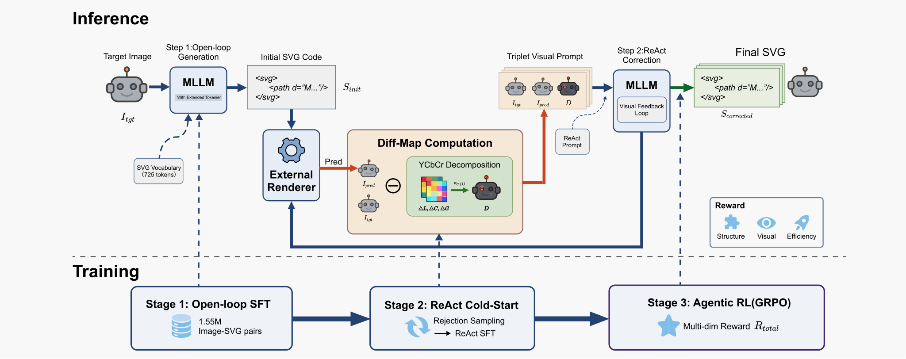
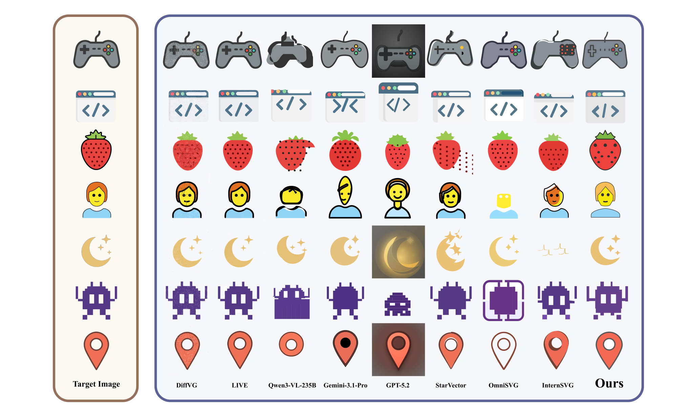

<h1 align="center">RefineSVG</h1>
<h3 align="center">Visual Feedback-Driven Reinforcement Learning for Image-to-SVG Generation</h3>

<p align="center">
  <strong>Accepted at ACM Multimedia 2026 (ACM MM 2026)</strong><br>
  Shaobo Liu · Feiqiao Mao · Shuaishuai Zhou · Yan Zhan · Weiqi Tan · Zhiqiong Lu · Zhengping Liang
</p>

<div align="center">

[](https://arxiv.org/abs/2607.27699)
[](https://arxiv.org/abs/2607.27699)
[](https://huggingface.co/xiaobo6668/RefineSVG_7B)
[](https://github.com/liuxiaobo66/RefineSVG)

[**Paper**](https://arxiv.org/abs/2607.27699) · [**PDF**](https://arxiv.org/pdf/2607.27699) · [**7B checkpoint**](https://huggingface.co/xiaobo6668/RefineSVG_7B) · [**Model files**](https://huggingface.co/xiaobo6668/RefineSVG_7B/tree/main)

</div>

## 📣 News

- **ACM MM 2026:** RefineSVG has been accepted at the 34th ACM International Conference on Multimedia.
- **Model release:** The **7B Stage 3 / post-GRPO checkpoint** is publicly available on [Hugging Face](https://huggingface.co/xiaobo6668/RefineSVG_7B).
- **Paper:** The [arXiv paper](https://arxiv.org/abs/2607.27699) includes the complete supplementary material.

## 💡 Overview

**RefineSVG turns image-to-SVG generation into a visual correction loop.** The model generates an SVG draft, observes its rendered result alongside the target and a **Diff-Map**, then produces a corrected SVG. This closes the gap between writing vector code and seeing what that code actually renders.

The framework combines three components:

- **SVG-oriented semantic vocabulary:** 725 added tokens reduce average SVG sequence length by **52.8%** in the paper's tokenizer analysis.
- **Visual feedback:** a target / rendered draft / difference heatmap triplet guides **one correction round** after the initial generation.
- **Progressive training:** open-loop SVG SFT → rejection-sampled ReAct cold-start SFT → agentic GRPO with structural, semantic, and code-efficiency rewards.

This is the official implementation of RefineSVG, including the training pipeline and the modified verl framework used for two-turn rollout and validation.

**Contents:** [Method](#-method) · [Results](#-main-results) · [Models & inference](#-models--inference) · [Training](#part-i-sft-training-stage-1--2) · [Evaluation](#evaluation) · [Citation](#-citation)

## 🔬 Method

<p align="center">
  <a href="assets/figures/method.png">
    
  </a>
</p>

*Figure 2 from the paper. Top: draft → render → Diff-Map → correction. Bottom: the three-stage training pipeline.*

At inference time, CairoSVG renders the first draft. The feedback tool combines luminance, chroma, and edge differences into a colorized heatmap, and packages **target | rendered draft | Diff-Map** as one RGB image. The model receives this feedback as a new user turn while retaining the original image and conversation history, then returns the complete corrected SVG.

## 📊 Main Results

Selected comparisons from **Table 1 on SVG-Stack-1K**, a stratified subset of the SVG-Stack test split focused on moderately and highly complex samples. The full comparison, including optimization-based methods, is in the [paper](https://arxiv.org/html/2607.27699v1#S4).

| Method | DINO ↑ | PSNR ↑ | CLIP-I2I ↑ | SSIM ↑ | LPIPS ↓ | MSE ↓ | Final SVG tokens |
|---|---:|---:|---:|---:|---:|---:|---:|
| GPT-5.2 | **0.9247** | 11.92 | **0.9483** | 0.6114 | 0.2801 | 0.1228 | 849 |
| Gemini-3.1-Pro | 0.9138 | 13.19 | 0.9433 | 0.6564 | 0.2414 | 0.1205 | 1.14k |
| StarVector-8B | 0.7820 | 9.89 | 0.8830 | 0.4296 | 0.3329 | 0.4049 | 4.51k |
| OmniSVG-8B | 0.8212 | 11.72 | 0.8838 | 0.6072 | 0.2784 | 0.2273 | 5.79k |
| InternSVG-8B | 0.8647 | 13.70 | 0.9098 | 0.6397 | 0.2390 | 0.1980 | 8.34k |
| Qwen2.5-VL-7B + SVG-SFT (Stage 1) | 0.7725 | 10.14 | 0.8794 | 0.4097 | 0.3496 | 0.4121 | 8.91k |
| **RefineSVG-7B (Stage 3)** | 0.9207 | **15.86** | 0.9306 | **0.7114** | **0.1891** | **0.0603** | **634** |

RefineSVG-7B leads **PSNR, SSIM, LPIPS, and MSE among the MLLM-based methods compared in the paper**. Compared with its Stage 1 SVG-SFT baseline, it gains **5.72 dB PSNR** while producing roughly **14× shorter final SVGs**.

*RefineSVG results are averaged over three independent runs at temperature 0.6. Token counts measure the final corrected SVG, not the complete draft-plus-correction episode. Bold denotes the best value among the selected rows.*

### Qualitative comparison

<p align="center">
  <a href="assets/figures/qualitative.png">
    
  </a>
</p>

*Figure 5 from the paper. Out-of-distribution examples from MMSVG-Illustration, MMSVGBench, and svg-emoji. Click either figure to view it at full resolution.*

## 📦 Models & Inference

### Released checkpoint

| Model | Training stage | Download |
|---|---|---|
| **RefineSVG-7B** | **Stage 3 / post-GRPO** | [Hugging Face model](https://huggingface.co/xiaobo6668/RefineSVG_7B) · [Files](https://huggingface.co/xiaobo6668/RefineSVG_7B/tree/main) |

Download the complete checkpoint, including its tokenizer, processor configuration, and chat template. The paper also evaluates a 3B variant, and the repository contains 3B training configurations; **a 3B checkpoint download is not provided in this release**.

### Current inference implementation

The two-turn implementation is integrated into the modified **verl/Ray rollout and validation pipeline**. **The current release does not include a standalone inference script independent of verl/Ray.**

Use the [7B rollout configuration](SVG_refine_grpo/configs/svg_grpo_qwen25vl7b_prod.yaml) and the [Evaluation](#evaluation) section as the existing implementation reference. Set `MODEL_PATH` to the downloaded Stage 3 checkpoint when evaluating it; Stage 3 *training* below instead starts from a Stage 2 checkpoint. The production launch scripts are training entry points.

For an independent implementation, adapt the existing interaction rather than treating the training launcher as an inference command:

1. Generate a draft wrapped in `<SVG_DRAFT>...</SVG_DRAFT>`, using `PROMPT_TEXT` from [the data preparation script](SVG_refine_grpo/prepare_svg_refine_parquet.py).
2. Extract and render the SVG with the [feedback tool](SVG_refine_grpo/svg_react_feedback_tool.py). The [tool configuration](SVG_refine_grpo/configs/tool_config.yaml) uses 256 × 256 panels, producing a 768 × 256 RGB triplet before model preprocessing.
3. Append the feedback image and `DEFAULT_FEEDBACK_TEXT` from the [agent loop](SVG_refine_grpo/svg_react_agent_loop.py) as a new **user turn**, preserving the original image and full conversation history. The next response contains the complete corrected SVG in `<SVG_FINAL>...</SVG_FINAL>`.

Keep the checkpoint's processor and chat template. The [agent configuration](SVG_refine_grpo/configs/agent_prod.yaml) sets `include_tool_text_in_feedback: false`, excluding numeric tool feedback. Further implementation details are in the [maintainer's explanation](https://github.com/liuxiaobo66/RefineSVG/issues/1#issuecomment-5868680186).

---

## Project Structure

<details>
<summary>Expand the repository layout</summary>

```
RefineSVG/
├── utils/                             # Utility scripts
│   ├── build_svg_prompt_initialized_model.py  # SVG vocab extension with semantic init
│   └── svg_vocab.tsv                          # SVG token vocabulary (725 tokens)
│
├── LlamaFactory/                      # LLaMA-Factory framework (Stage 1 & 2 SFT)
│   ├── data/                          # Dataset configs and data placeholders
│   │   ├── dataset_info.json          # Dataset registry (SVG datasets only)
│   │   ├── svgmix256_sft_canvas256/   # Stage 1 data (placeholder)
│   │   └── svg_repair_react_once_.../  # Stage 2 data (placeholder)
│   └── examples/train_full/           # Training configs
│       ├── qwen2_5vl_7b_svgmix256_full_sft.yaml  # Stage 1: 7B config
│       ├── qwen2_5vl_7b_full_sft_sh_rank*.sh      # Stage 1: 4-node launch scripts
│       └── stage2/                                  # Stage 2 configs
│           ├── qwen25vl_7b/                         # 7B model
│           └── qwen25vl_3b/                         # 3B model
│
├── verl/                              # Modified verl framework (fork of v0.6.1)
│
└── SVG_refine_grpo/                   # Stage 3: GRPO training code and configs
    ├── svg_react_agent_loop.py        # Multi-turn agent loop (draft → tool feedback → refine)
    ├── svg_react_feedback_tool.py     # Tool that renders draft SVG and provides visual feedback
    ├── svg_reward.py                  # Composite reward function (L2 + DINO + CLIP + efficiency)
    ├── prepare_svg_refine_parquet.py  # Script to prepare training/val parquet datasets
    ├── prepare_smoke_subsets.py       # Create small subsets for smoke testing
    ├── patch_qwen25vl_config.py       # Monkey-patch for Qwen2.5-VL rope_scaling compatibility
    ├── analyze_trajectories.py        # Analyze training trajectories
    ├── runtime_env.yaml               # Ray runtime environment configuration
    │
    ├── configs/                       # Hydra config files
    │   ├── svg_grpo_qwen25vl7b_prod.yaml   # 7B model, 4-node production
    │   ├── svg_grpo_qwen25vl_prod.yaml     # 3B model, 4-node production
    │   ├── svg_grpo_qwen3vl_prod.yaml      # Qwen3-VL 4B production
    │   ├── svg_grpo_qwen25vl_smoke.yaml    # 3B smoke test (single node)
    │   ├── svg_grpo_qwen3vl_smoke.yaml     # Qwen3-VL smoke test
    │   ├── agent_prod.yaml                  # Agent loop config (production)
    │   ├── agent_smoke.yaml                 # Agent loop config (smoke test)
    │   └── tool_config.yaml                 # Tool definitions for multi-turn
    │
    ├── clip_similarity_api/           # CLIP/DINO/LPIPS similarity API server
    │   ├── clip_similarity_api_server.py    # FastAPI server for image similarity
    │   ├── start_clip_similarity_api.sh     # Start the API server
    │   └── ...
    │
    ├── ablation/                      # Ablation study configs and code
    │   ├── svg_grpo_qwen25vl7b_ablation_nodiff.yaml      # No-diff ablation
    │   ├── svg_grpo_qwen25vl7b_ablation_no_coldstart.yaml # No cold-start ablation
    │   ├── RL/                                             # Single-turn RL baseline
    │   └── ...
    │
    ├── run_qwen25vl7b_prod.sh        # Launch script: 7B model training
    ├── run_qwen25vl_prod.sh          # Launch script: 3B model training
    ├── run_qwen25vl_smoke.sh         # Launch script: smoke test
    │
    ├── images_whitebg_train/          # Training images (256×256 RGB, white background)
    ├── images_whitebg_val/            # Validation images
    ├── data/                          # Generated data subsets
    ├── train.parquet                  # Training dataset (generated by prepare_svg_refine_parquet.py)
    └── val.parquet                    # Validation dataset
```


</details>

## Prerequisites

- CUDA 12.8
- 4 nodes × 8 GPUs (80GB+ VRAM each) for production training
- 1 node × 8 GPUs for smoke testing

---

## Step 0: Vocabulary Extension (SVG Tokens)

Before training, extend the base model's tokenizer with 725 SVG-specific tokens (tag names, attribute names, color values, numeric patterns, etc.). Each new token embedding is initialized from the mean embedding of its semantic description (InternSVG-style prompt-based initialization), which significantly improves convergence compared to random initialization.

```bash
python utils/build_svg_prompt_initialized_model.py \
    --src-model /path/to/Qwen2.5-VL-7B-Instruct \
    --dst-model /path/to/Qwen2.5-VL-7B-Instruct-SVG \
    --vocab-tsv utils/svg_vocab.tsv \
    --prompt-field en_prompt \
    --trust-remote-code \
    --torch-dtype bfloat16 \
    --device-map auto
```

| Argument | Description |
|----------|-------------|
| `--src-model` | Path to the base Qwen2.5-VL model (e.g., `Qwen2.5-VL-7B-Instruct`) |
| `--dst-model` | Output directory for the extended model |
| `--vocab-tsv` | TSV file with SVG tokens and semantic prompts (provided in `utils/`) |
| `--prompt-field` | Column in TSV for semantic initialization (`en_prompt` recommended) |
| `--torch-dtype` | Model loading dtype (`bfloat16` recommended for 7B) |
| `--device-map` | Device placement (`auto` for multi-GPU, `none` for CPU-only) |

**Expected output:** Original vocab 151,665 → New vocab 152,390 (+725 tokens). Generates `added_tokens_report.json` and `added_tokens_report.txt` in the output directory.

The extended model at `--dst-model` is used as `model_name_or_path` for Stage 1 SFT below.

---

## Part I: SFT Training (Stage 1 & 2)

### Environment Setup

```bash
conda create -n SFT python=3.11 -y
conda activate SFT

cd LlamaFactory
pip install -e .
pip install -r requirements/metrics.txt
```

### Stage 1: SFT — Image-to-SVG Generation

Stage 1 trains the vocab-extended model (from [Step 0](#step-0-vocabulary-extension-svg-tokens)) to generate SVG code from images using supervised fine-tuning on SVGMix-256.

#### Data Preparation

1. Download the SVGMix-256 dataset and prepare it in ShareGPT format:
   - Place JSONL files in `LlamaFactory/data/svgmix256_sft_canvas256/`
   - Place images in `LlamaFactory/data/svgmix256_sft_canvas256/images/`
   - The dataset is registered in `LlamaFactory/data/dataset_info.json`

2. Each sample contains a single-turn conversation: user provides an image, assistant responds with SVG code.

#### Training (4 nodes × 8 GPUs)

```bash
# Launch on each node:
# Node 0 (head):
bash LlamaFactory/examples/train_full/qwen2_5vl_7b_full_sft_sh_rank0.sh
# Node 1-3:
bash LlamaFactory/examples/train_full/qwen2_5vl_7b_full_sft_sh_rank{1,2,3}.sh
```

Edit the YAML config (`qwen2_5vl_7b_svgmix256_full_sft.yaml`) to set:
- `model_name_or_path`: Path to the vocab-extended model from Step 0 (e.g., `Qwen2.5-VL-7B-Instruct-SVG`)
- `dataset_dir` / `media_dir`: Path to `LlamaFactory/data/`
- `output_dir`: Where to save checkpoints
- `MASTER_ADDR` in the shell scripts: IP of the head node

#### Key Hyperparameters (Stage 1)

| Parameter | Value | Description |
|-----------|-------|-------------|
| Learning rate | 1e-5 | Higher LR for initial SFT |
| Epochs | 3 | |
| Cutoff length | 16384 | Max sequence length |
| Batch size | 1 × 16 (grad accum) | Per-GPU batch × gradient accumulation |
| DeepSpeed | ZeRO Stage 2 | Memory-efficient distributed training |
| `freeze_vision_tower` | true | Only train language model |

### Stage 2: SFT — Multi-Turn SVG Repair

Stage 2 fine-tunes the Stage 1 model on multi-turn repair conversations, where the model learns to refine SVGs based on visual feedback.

#### Data Preparation

1. Prepare multi-turn repair data in ShareGPT format:
   - Place JSONL files in `LlamaFactory/data/svg_repair_react_once_structmatch/`
   - Place source images and rendering assets in the corresponding subdirectories
   - Each sample is a multi-turn conversation: user provides image → assistant drafts SVG → user provides visual feedback → assistant refines SVG

2. The dataset variants are registered in `dataset_info.json`:
   - `svg_repair_react_once_structmatch_train_nodiff` / `_eval_nodiff`: Without visual diff (recommended)
   - `svg_repair_react_once_structmatch_train` / `_eval`: With visual diff

#### Training (4 nodes × 8 GPUs)

```bash
# 7B model:
bash LlamaFactory/examples/train_full/stage2/qwen25vl_7b/qwen2_5vl_7b_stage2_sh_rank{0,1,2,3}.sh

# 3B model:
bash LlamaFactory/examples/train_full/stage2/qwen25vl_3b/qwen2_5vl_3b_stage2_sh_rank{0,1,2,3}.sh
```

Edit the YAML config to set:
- `model_name_or_path`: Path to Stage 1 checkpoint
- `output_dir`: Where to save Stage 2 checkpoints

#### Key Hyperparameters (Stage 2)

| Parameter | Value | Description |
|-----------|-------|-------------|
| Learning rate | 1e-6 | Lower LR for fine-tuning |
| Epochs | 2 | |
| Cutoff length | 24576 | Longer for multi-turn |
| Batch size | 1 × 16 | Per-GPU batch × gradient accumulation |

---

## Part II: GRPO Reinforcement Learning (Stage 3)

### Environment Setup

```bash
conda create -n RefineSVG python=3.12 -y
conda activate RefineSVG

# Install vLLM + SGLang (with or without Megatron)
bash scripts/install_vllm_sglang_mcore.sh
# Or without Megatron:
# USE_MEGATRON=0 bash scripts/install_vllm_sglang_mcore.sh

# Install the modified verl framework
cd verl
pip install --no-deps -e .
cd ..

# Flash Attention
pip install flash-attn --no-build-isolation

# Pin transformers version for compatibility
pip install "transformers==4.57.0"

# SVG rendering system dependencies
apt-get update && apt-get install -y \
    libcairo2 libpango-1.0-0 libgdk-pixbuf-2.0-0 \
    libffi-dev shared-mime-info

# Python rendering & data dependencies
pip install -U pip setuptools wheel
pip install -U pyarrow cairosvg pillow orjson datasets
```

### Configuration

#### Path Setup

All configs use placeholder variables. Before running, set:

```bash
export VERL_DIR=/path/to/RefineSVG/verl
export PROJECT_DIR=/path/to/RefineSVG/SVG_refine_grpo
export MODEL_PATH=/path/to/stage2_checkpoint   # Stage 2 SFT output
export OUTPUT_DIR=/path/to/outputs
```

Alternatively, edit the YAML configs directly (under `SVG_refine_grpo/configs/`).

#### Reward API Services

The reward function calls external API servers for CLIP, DINOv2, and LPIPS similarity. Start them before training:

```bash
cd SVG_refine_grpo/clip_similarity_api
export CLIP_MODEL_PATH=/path/to/openai/clip-vit-large-patch14
bash start_clip_similarity_api.sh

# DINOv2 and LPIPS APIs should be started similarly on ports 18090 and 18100
# See clip_similarity_api/README.md for details
```

Update the API URLs in the training config if your servers run on different hosts/ports.

### Data Preparation

```bash
# Edit paths in prepare_svg_refine_parquet.py, then run:
python SVG_refine_grpo/prepare_svg_refine_parquet.py
```

This creates `train.parquet` and `val.parquet` with the following schema:

| Field | Description |
|-------|-------------|
| `data_source` | Dataset identifier |
| `agent_name` | `"svg_react_agent"` (for multi-turn agent routing) |
| `prompt` | Chat-format prompt with `<image>` placeholder |
| `images` | List of image file paths |
| `ability` | `"svg_generation"` |
| `reward_model.ground_truth` | Ground-truth SVG code |
| `extra_info` | Metadata (SVG length, difficulty band, etc.) |
| `uid` | Unique sample identifier |

### Training

#### Smoke Test (single node, 8 GPUs)

```bash
bash SVG_refine_grpo/run_qwen25vl_smoke.sh
```

#### Production Training (4 nodes)

**1. Set up Ray cluster:**

```bash
# On head node:
ray start --head --port=6379

# On each worker node:
ray start --address=<HEAD_IP>:6379
```

**2. Launch training:**

```bash
# Qwen2.5-VL-7B (recommended)
bash SVG_refine_grpo/run_qwen25vl7b_prod.sh

# Qwen2.5-VL-3B
bash SVG_refine_grpo/run_qwen25vl_prod.sh

# Qwen3-VL-4B
# (edit run script to use svg_grpo_qwen3vl_prod config)
```

**3. Hydra overrides:**

```bash
bash SVG_refine_grpo/run_qwen25vl7b_prod.sh \
    actor_rollout_ref.actor.clip_ratio_high=0.3 \
    trainer.total_epochs=3 \
    data.train_batch_size=64
```

### Key Hyperparameters (Stage 3)

| Parameter | Default | Description |
|-----------|---------|-------------|
| `actor.lr` | 1e-6 | Learning rate |
| `actor.clip_ratio` | 0.2 | PPO clip ratio (symmetric) |
| `actor.clip_ratio_high` | 0.28 | Asymmetric clip upper bound |
| `actor.clip_ratio_c` | 3.0 | Importance weight clipping |
| `rollout.n` | 8 | Samples per prompt (GRPO group size) |
| `rollout.temperature` | 1.0 | Sampling temperature |
| `data.train_batch_size` | 128 | Prompts per training step |
| `reward_kwargs.weight_l2` | 0.30 | L2 pixel similarity weight |
| `reward_kwargs.weight_dino` | 0.50 | DINOv2 similarity weight |
| `reward_kwargs.weight_efficiency` | 0.20 | SVG efficiency weight |

## Ablation Studies

### No-diff ablation (without visual diff feedback)

```bash
bash SVG_refine_grpo/ablation/run_ablation_nodiff.sh
```

### No cold-start ablation (training from SFT without RL warm-up)

```bash
bash SVG_refine_grpo/ablation/run_ablation_no_coldstart.sh
```

### Single-turn RL baseline

```bash
bash SVG_refine_grpo/ablation/RL/run_ablation_single_turn.sh
```

## Evaluation

For **validation only**, use the existing verl/Ray environment, prepared parquet data, Ray cluster, and reward API services described above. Set `MODEL_PATH` to the released Stage 3 checkpoint and pass these overrides to the [7B launcher](SVG_refine_grpo/run_qwen25vl7b_prod.sh):

```bash
export MODEL_PATH=/path/to/RefineSVG_7B
bash SVG_refine_grpo/run_qwen25vl7b_prod.sh \
    trainer.val_before_train=True \
    trainer.val_only=True \
    trainer.resume_mode=disable \
    trainer.validation_data_dir=/path/to/eval_outputs
```

`trainer.val_only=True` returns after the initial validation rather than continuing training. `trainer.resume_mode=disable` prevents an existing training checkpoint from overriding `MODEL_PATH`. Results are dumped as JSONL with per-sample metrics. This uses the existing production configuration and infrastructure; it is not a standalone or lightweight inference entry point.

## Modified verl Framework

The `verl/` directory contains a modified fork of [verl](https://github.com/volcengine/verl) (v0.6.1) with the following changes:

1. **Multi-turn agent loop** (`verl/experimental/agent_loop/agent_loop.py`): Extended to support multi-turn agentic generation with tool calls and visual feedback.
2. **Qwen2.5-VL support** (`verl/models/transformers/qwen2_vl.py`): Model-specific adaptations.
3. **Metric utils** (`verl/trainer/ppo/metric_utils.py`): Robust handling of None values in validation metrics.
4. **Ray trainer** (`verl/trainer/ppo/ray_trainer.py`): Inference result dumping with UIDs, per-request timing, timestamped output directories.
5. **SGLang async server** (`verl/workers/rollout/sglang_rollout/async_sglang_server.py`): Async rollout improvements.
6. **Config extensions** (`verl/workers/config/`): Additional config fields for agent and rollout settings.

## 📄 Citation

If you find RefineSVG useful, please cite the paper:

```bibtex
@misc{liu2026refinesvgvisualfeedbackdrivenreinforcement,
  title         = {RefineSVG: Visual Feedback-Driven Reinforcement Learning for Image-to-SVG Generation},
  author        = {Shaobo Liu and Feiqiao Mao and Shuaishuai Zhou and Yan Zhan and Weiqi Tan and Zhiqiong Lu and Zhengping Liang},
  year          = {2026},
  eprint        = {2607.27699},
  archivePrefix = {arXiv},
  primaryClass  = {cs.CV},
  url           = {https://arxiv.org/abs/2607.27699},
}
```

## License

This project builds upon:
- [verl](https://github.com/volcengine/verl) (Apache 2.0) - RL training framework
- [LLaMA-Factory](https://github.com/hiyouga/LLaMA-Factory) (Apache 2.0) - SFT training framework

